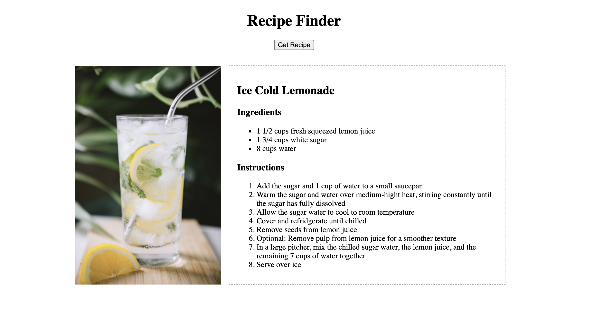
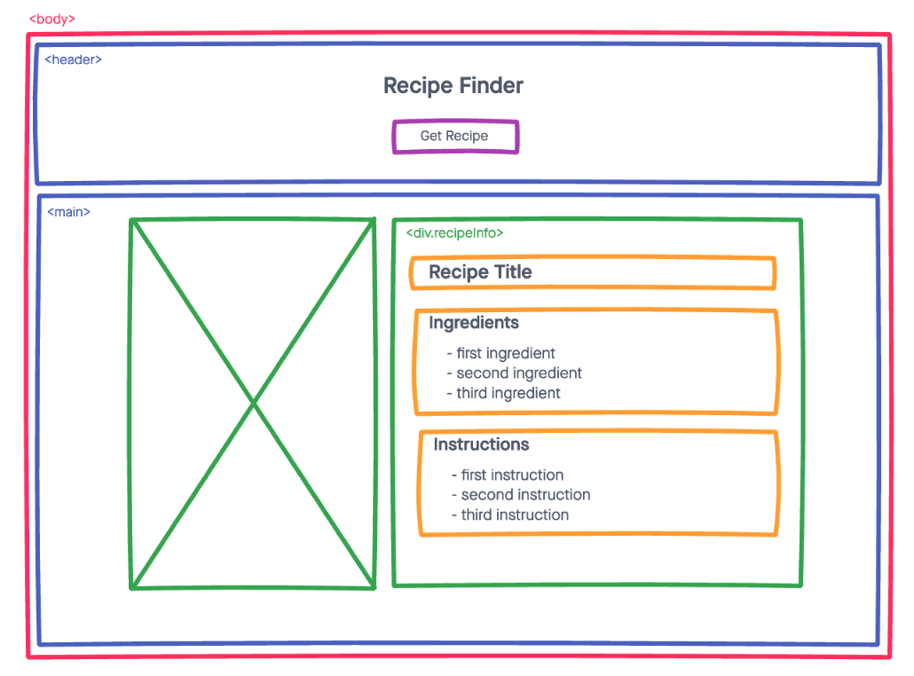
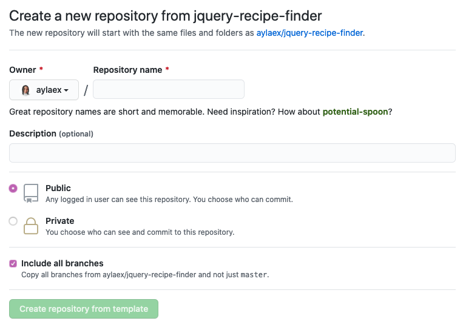
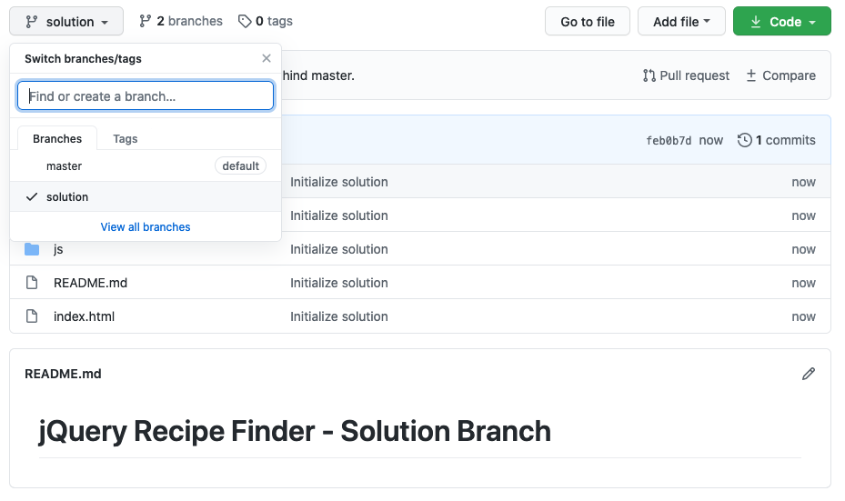

# jQuery Recipe Finder

## Introduction:

In preparation for project week, and before we throw one more new concept at you, let's just take a moment to review the material we've learned so far and practice stringing it together into a real world application from scratch.

Since we haven't yet learned how to fetch data from an API (the last concept you'll be learning for Unit 1) we're going to be working with some dummy API data to practice rendering it to the page using jQuery.

While going through this exercise, I'd highly recommend paying attention to the workflow, as your worfklow during project week should be very similar. The only difference here is that some of the preparation has been taken care of for you, for example: coming up with a project idea, coming up with user stories for your project, creating a wireframe, creating the git repo, and setting up the file strucuture.

## End Game:

Beginning with the end in mind, here's what we're going to build:

## User Stories:

Wikipedia does a great job of defining user stories:

> In software development and product management, a user story is an informal, natural language description of features of a software system. They are written from the perspective of an end user or user of a system, and may be recorded on index cards, Post-it notes, or digitally in project management software. - [Wikipedia](https://en.wikipedia.org/wiki/User_story)

### Our User Stories:

- AAU (as as user) I should be able to click a button and get a random recipe

Our application really only has one user story because it's so basic in functionality, but imagine how a more complex app may have additional user stories for additional features.

In preparation for project week, you're going to want to come up with an idea for an application and write down the user stories that go along with the features you plan to implement.

## Wireframes:

A wireframe is basically just a lo-fi sketch of the physical appearance of your application.
There are lots of different wireframing tools (both free and paid) on the market, so we'd recommend finding one that works well for you. Wireframes can also be done by hand, but if you have the time, it's always good to get some exposure to and practice with collaborative tools that you may be using on the job, post-cohort.

For wireframing, we recommend checking out [InVisionApp Freehand](https://www.invisionapp.com/freehand)

For the sake of time, the wireframe for this project has been created for you, but this is something you will be expected to do for your project before you begin coding. If you'd like some practice, pick a website-- any site, and draw a wireframe of it. Or come up with your own design!

Typically you'll want to have a wireframe for each page of your application in both the desktop and mobile view. Again, for the sake of time, we're not going to go too indepth into project planning or styling, but keep that in mind!

### Our Wireframe:

## Solution Code

This repo contains solution code!
If you'd like access to that solution code from your copy of this repo, be sure to check the `include all branches` option when using the template.

This solution code has been provided so everyone will have access to a working, well commented, well formatted solution. However, I would strongly encourage you to practice adding helpful comments, and writing well formatted and clear code of your own, because your own solutions and comments will be a million times more helpful to you than anyone else's could be.

We haven't yet leared about git branching, but in the meantime, just know that the solution code can be found on github. When you switch to the solution branch, the code will update and you can click on any file on github to see the solution code for that file.

